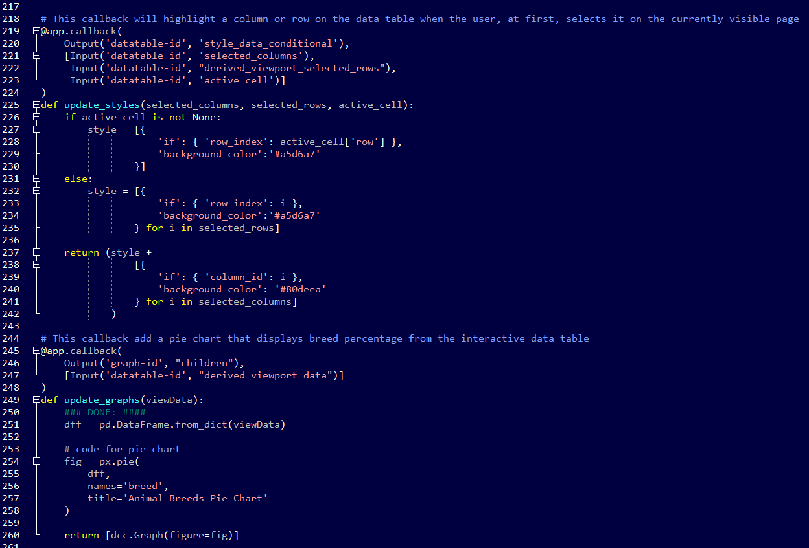

     

---

## Salvare Search for Rescue Web Application CS340 Client/Server Development Databases Category

---

Salvare Search for Rescue is a web application that works with an existing database from animal shelters. It helps identify and categorize available dogs to train for different types of rescue, such as water rescue, mountain or wilderness rescue, locating humans after a disaster, or finding a specific human by tracking their scent. The application helps interact with and visualize individual dog profiles to train from a MongoDB database.

This artifact involves the engineering of practices of validating input data and architect and design with default denial when accessing databases records. This skill in me a security mindset that anticipates adversarial exploits in software architecture and designs to expose potential vulnerabilities, mitigate design flaws, and ensure privacy and enhanced data security and resource. The source code is clearly and adequately documented with an easy-to-maintain commenting style and consistent with Python standards and supports clean code through descriptive functions names and variable names. The CRUD module that handles the database records supports code reusability by importing it as a module by other Python scripts.

    

        <iframe style="position: absolute; top: 0; left: 0; width: 100%; height: 100%;" src="https://www.youtube-nocookie.com/embed/r9EonyBs9I8?rel=0" title="Salvare Search for Rescue Web App Demostration Video" frameborder="0" allow="accelerometer; autoplay; clipboard-write; encrypted-media; gyroscope; picture-in-picture" allowfullscreen></iframe>
    

    
<em>Figure 1 - Web App Demonstration Video</em>

The implemented data structure is programmatic, where the stored variable values can be used efficiently in different functions and callbacks through the web application. This approach improves the design and evaluation of computing solutions that solve a given problem using algorithmic principles and computer science practices and standards appropriate to it while managing the trade-offs involved in design choices. As shown in the short video, I accomplished the process of recreating the web app in a Windows environment. I produced a working program beyond the initial Linux environment, which required researching things I have done in other languages to create an artifact on multiple operating systems like Windows and macOS.

    
    
<em>Figure 2 - App Source Code Example</em>

As a document database, MongoDB brings a facility to manage significant data and makes it easy to store structured or unstructured data. It uses a JSON-like format to store documents. This format directly maps to native objects in modern programming languages, making it a natural choice as I don't need to think about normalizing data. The web application's CRUD is transparent and straightforward. However, the dashboard development using the Dash framework was more time-consuming. Understanding and exploring how the dash core, HTML components, and callbacks work to produce an efficient and straightforward coding structure.

There is a lot behind the DASH framework, and their libraries are under active development, so installation and upgrade frequently are necessary. With the reproduction of the web application in a different environment, I update and actualize the web app documentation to guide others in recreating the web app in a Linux or Windows environment. The clear and well-documented guide improves my skill in designing, developing, and delivering professional written and visual communication documentation that is coherent, technically sound, and appropriately adapted to specific audiences and contexts.

---

Artifact enhancement files repository at [CS340 Client/Server Development](https://github.com/arsari/ePortfolio/tree/main/enhancement/CS340-databases "Salvare Search for Rescue Web App - Repository")

---

    <a href="#">
        <button style="font-size: 10px; font-weight: 500; background: #4169e1; color: #ffffff; border-radius: 50px; border-style: solid; border-color: #4169e1; padding: 5px 8px;">Back to Top &#8593;</button>
    </a>

