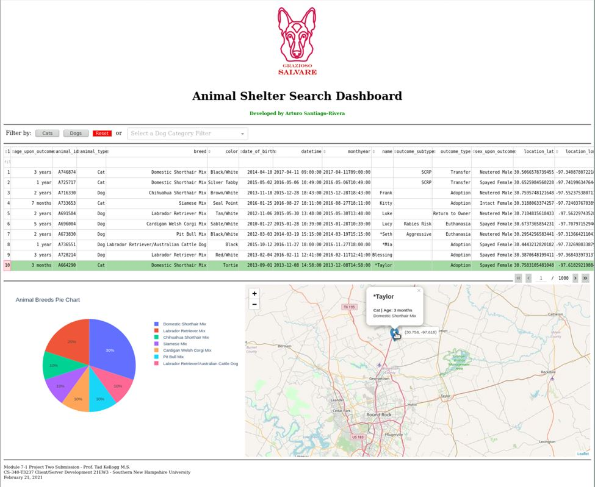

# Salvare Search for Rescue Web Application

---

## CS340 Client/Server Development 21EW3 February, 2021

---

     

## Overview

A web application that works with existing databases from animal shelters to identify and categorize available dogs to train for different types of rescue, such as water rescue, mountain or wilderness rescue, locating humans after a disaster, or finding a specific human by tracking their scent. The application helps interact with and visualize individual dog profiles to train from a MongoDB database.

Through a user-friendly, intuitive client-facing web application dashboard, the user reduces errors and training time. The software design pattern used for this multi-tier application is the Model View Controller (MVC). Additionally, a RESTful protocol extends the HTTP protocol to give an application programming interface (API).

    
    
<em>Figure 1 - Salvare Search Web App Client/Database Dashboard Screenshot</em>

In this artifact, I employ industry-standard Python code best practices and techniques such as in-line comments, appropriate naming conventions, and formatting in conformance with proper coding standards, making the code easy to read and enhancing the application code organization. The program code is easy to read and follows formatting best practices defined by the industry, such as indentation in conformance with appropriate coding standards.

The source code is well-structured, consistent in style, and consistently properly formatted, including line breaks. We utilize appropriate syntax and conventions in terms of their best practice and use in programming. The implemented data structures are programmatic, where the stored variable values can be used efficiently in other methods. Method names are verbs as they represent actions being performed on something. All cases are covered in an IF-ELIF block, including ELSE or DEFAULT clauses.

This web application demonstrates our competencies to apply database systems concepts using a non-relational database like MongoDB and principles in developing a client/server application based on Python programming language, libraries, and framework. Demonstrates our understanding to develop client-side code that interfaces with databases.

**For a detailed description, function, and screen examples, please read the [Word Document](CS340-M7-2_Paper.pdf) paper.**

## Reflection

---

  

---

<small>_[Updated April, 2022 by ASR]_</small>

