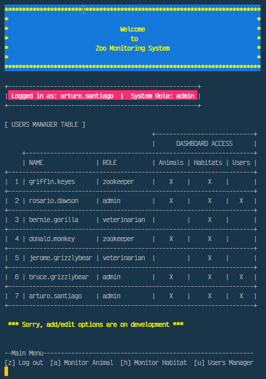

# Zoo Monitoring System Program

---

## IT145 Foundation in Application Development 18EW5 June 2018

---

    

## Overview

Managing a Zoo’s computer infrastructure includes two key components: controlling the access to system data and monitoring the animal/habitat activities in exhibits. As a duty of the role of managing the computer infrastructure, I have to develop a working program and documentation describing the development process for the authentication and authorization of the people to gain access to data in the computer systems. Them, I extended the program and documentation to monitor the activities of the animals in the care of the zookeeper and monitor their living habitats.

> [Program Algorithm](IT145-M7-1_Algorithm.pdf "Program Algorithm")

The program authentication and authorization part was designed and developed in JAVA language back in 2018. Now we have revised the code and libraries to compiled it using JAVA-JDK 17. The program is best run in the computer terminal (macOS) or command prompt/PowerShell (Windows). I wanted to show different screens according to the menu options, clear the screen for each option, and not show everything on one screen. For this purpose, I use a code block that determines the OS in which the program is executed.

> [Program Pseudocode](IT145-M7-1_Pseudocode.pdf "Program Pseudocode")

Significant errors can come from splitting the code into methods and classes and classifying them and their location when they are imported into the program. Because of this form of classification, I worked the program to handle errors by determining if it runs through the NetBeans output shell or OS terminal shell/bash. To resolve the program code to the point I wanted, I explored different blocks of codes to show a simple GUI but of good presentation. I use the Jansi 2.1.0 API JAVA library, which allows for adding ANSI colors to the dashboard screens.

Working with file streaming has been extremely exciting, making me think about the program's enhancements with attention to detail. I accomplished all my improvement for the program presentation and simplified the code classes and methods. I produce a working program beyond an input/output exercise required to research things I have done in other languages, which can be compiled on multiple operating systems like Windows and macOS.

### Program Execution

To compile and run the program, in the computer terminal, `cd` to the directory where the program files and directory are located and execute the following commands:

`javac -cp ./org; classes/*.java ZooMonitorSystem.java`

`java ZooMonitorSystem`

## Reflection

## Screenshots

 _Figure 1 - Main Dashboard Module Admin Role_

 _Figure 2 - User Management Module Admin Role_

---

  

---

<small>_[Updated April, 2022 by ASR]_</small>
