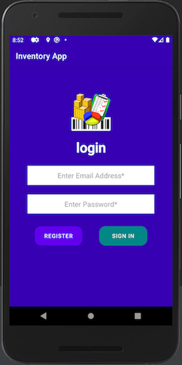
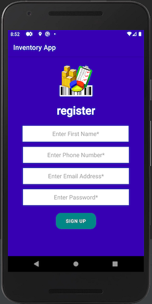
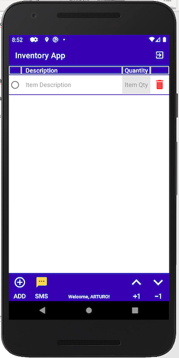
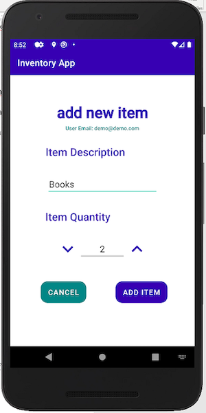
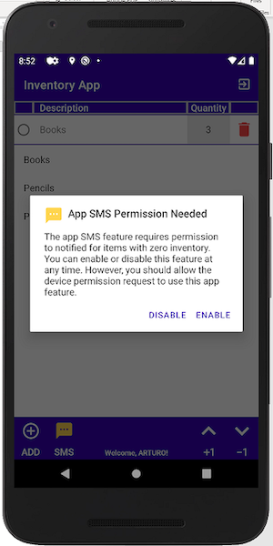
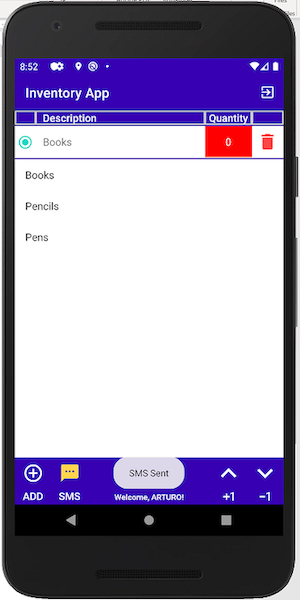
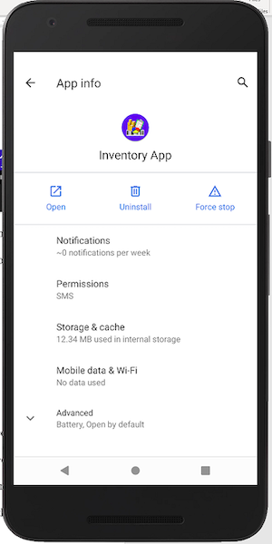

# Inventory App - Android Mobile Application

---

## CS360 Mobile Architect and Programming 21EW6 August, 2021

---

    

## Overview

> *Note: This is the original repository of the partially complete artifact for SNHU CS360 Mobile Architect & Programming 21EW6 computer science course. For the enhancement repository and fully operational mobile application visit the [ePortfolio - Software Design and Engineering](https://arsari.github.io/ePortfolio/#softwaredesign "Arturo Santiago-Rivera - ePortfolio Software Design and Engineering Category")*

As a team member of Mobile2App company, we have been hired to assist in developing a mobile application to track items in a warehouse, Inventory App (Option 1). The mobile application project will go through different steps, from planning to design to development, to be ready for launch in the following weeks.

The team takes time to orient themselves to understand the goals and users to target the app. The team meets weekly to discuss the latest client request sent in and assign the work implementing mobile application development principles and best practices in developing a mobile application.

**The Goal:** *The Inventory application tracks items in an inventory list through the primary use of mobile devices. For example, the track of the items through the app at a warehouse assists in managing and automating the warehouse logistics and accelerating the business's growth and expansion. The app allows the user to fulfill anywhere experience with real-time inventory visibility on any device. The app development is initially based on an installation for Android Devices.*

To achieve these goal, it has been requested that the mobile application must initially include the following features :

* A database with at least two tables to store: Inventory items, User logins and passwords
* A screen for sign-in or sign-up into the app.
* A grid screen that displays all items in the inventory.
* A mechanism where the user can add and remove items from the inventory.
* A mechanism where the user can increase or decrease the number of specific items in the inventory.
* A mechanism to notify the user when the amount of any item in the inventory has been reduced to zero

**For a detailed description, function, and screen examples, please see the following papers:**

[App Development Plan](CS360-M3-3_Paper.pdf "App Development Plan")

[Final App Launch Report](CS360-M7-2_Paper.pdf "Final App Launch Report")

## Screenshots

      

## General Reflection

Any idea starts with a planning phase, and a mobile application is not an exception. The experience of working with the development of the Inventory App project help me to understand how to plan a mobile app idea and what elements should be considered. The Inventory app screens and features considered support the user needs for the goal defined. The app provides standard visual design and interaction patterns appropriate for a consistent and intuitive user interface and user experience. The app UI is based on two main screens: login activity and an item listing the items in inventory. The activities display simplicity with a clear, consistent, intuitive, and predictable layout to produce a user-centered UI for the app.

The login activity is the main activity that the user initially interacts with to sign in to the app. When the user is authenticated, the app changes the screen to display the items activity, a  grid view list of the items in inventory. The baseline color theme includes a primary and secondary color of purple and teal and two variants of each. The app typography is based on Google Font Roboto with variants in size and style. The items activity is minimalist, so the UI designs keep the user's needs in mind, with clear symbols to add an item to the inventory, remove an item from the inventory, and increase or decrease item quantity.

Our approach to coding the mobile app was to develop in JAVA language with a minimum Android SDK of API 16 (Jelly Bean). The API 16 allows the app to run on approximately 99.8% of the devices. In the same way, searching on internet solutions and looking for help with collaborators on resolving programmatic problems during the development and integration of the design and the app source code is strategically implemented for the app development. It is of much gratification and helpful experience to work our ideas with a good collaboration team than doing it on our own, limiting our knowledge and experience and the growth of our concept.

The techniques and methodology learned from this project will apply to any concept idea that I wish to develop in the future. What I learned will help me prepare myself to be of value on any team because I understand producing an application planning document that will help and simplify the development of the idea on any mobile platform. I'm very confident in my design execution of the app idea. The experience working with the Android Studio will open more opportunities to better understand the UI functionality according to the code I need to develop.

The development and launch of a mobile app are not complete if testing is not implemented in the design and development phases. It is necessary to make a test of the app to ensure the code is functional. In our development, this was important, so it helps us better understand our app functionality and develop code free of errors for the activity layouts and the acting classes. Implementing app testing strategies is essential because testing on development intervals simplifies our design and development and helps us create quality apps in less time with fewer errors. Waiting until the end to test will give us headaches and stress trying to find the errors and bugs in our layout or classes harder.

There's a lot of information on how a mobile app design process should be. Understanding this process is crucial to produce an app of quality and acceptance to our target audience. Doing these alone is impossible, so it is questionable to think that we will create a great application ourselves. On the complete app design and development process, from initial planning to finalization, it is essential to look for help to understand our strengths and weaknesses. That means that to be successful, we need to build a collaborative team that could help us digest and practice the good practices of mobile app development. Focus on the implementation and relation of the design components and the programmatic code to continue finding opportunities to improve and innovate the mobile app to overcome a challenge.

As a designer and developer, I initially plan and program the purpose of my idea and my target audience. Every audience is different, and I should interpret user needs and implement them into the idea to develop by considering their needs in a prioritized way where the most important or favorite features are attended to first. It is like ranking the tasks that need to be incorporated into the app at their initial launch. The importance of looking for competitive apps and how they approach the application's design to resolve the UI/UX for the app and how similar features to our idea were presented and resolved by those apps. So, searching in the app store or the internet to find similar apps to the app idea we want to develop is a critical approach to implement.

Through the design and development of the component for the mobile app using the tool of Android Studio, we were particularly successful in demonstrating our knowledge, skills, and experience of our understanding of the relations of the activities and their elements and how to integrate them with the programmatic phase of the mobile app. We apply mobile development principles and best practices to develop mobile applications using user-centered design principles and industry standards. We conduct security, product assuredness, and compatibility checks before
launching the application.

---

  

---

<small>_[Updated April, 2022 by ASR]_</small>
